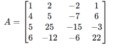
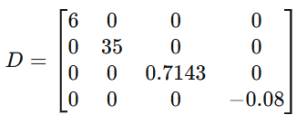
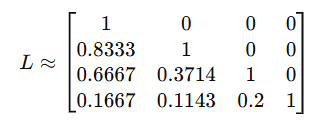
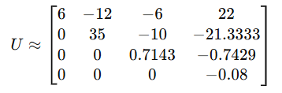
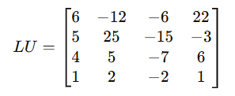
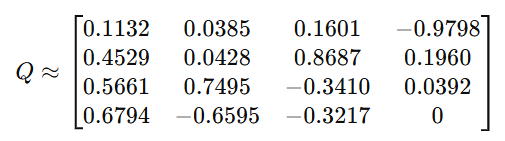
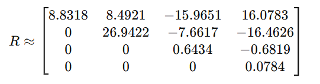

# Práctica 7. Diagonalización Por Método De Gauss, Factorización LU y Factorización QR

## Integrantes
- Alba Pérez Paulina
- Galeana Morán Miguel Ángel
- Herrera Barrera Joyce

## Uso e instalación

## Ejercicio 1

Implementar el método de eliminación Gaussiana para diagonalizar una matriz cuadrada.

La matriz con la que estaremos trabajando es:

Matriz Diagonal Resultante:

## Ejercicio 2

Programar una función que reciba una Matriz cuadrada de tamaño n × n, T, que además sea
triangular superior y que se encargue de eliminar todos los elementos superiores a la diagonal usando una
vez más el método de eliminación Gaussiana.

Matriz Resultante L:

Matriz Resultante U:

Debido a que se encontró un pivote 0, se tuvo que recurrir al pivoteo parcial (intercambiar las filas), lo que es igual a multiplicar nuestra matriz original por una matri de permutación P: PA= LU.

Es por ello que al multiplicar LU tenemos un reenglón intercambiado.

Matriz Resultante LU:

## Ejercicio 3

Programar la descomposición QR de una matriz A usando el Proceso de Gram-Schmidt.

Matriz Resultante Q:

Matriz Resultante R:

## Conclusión
